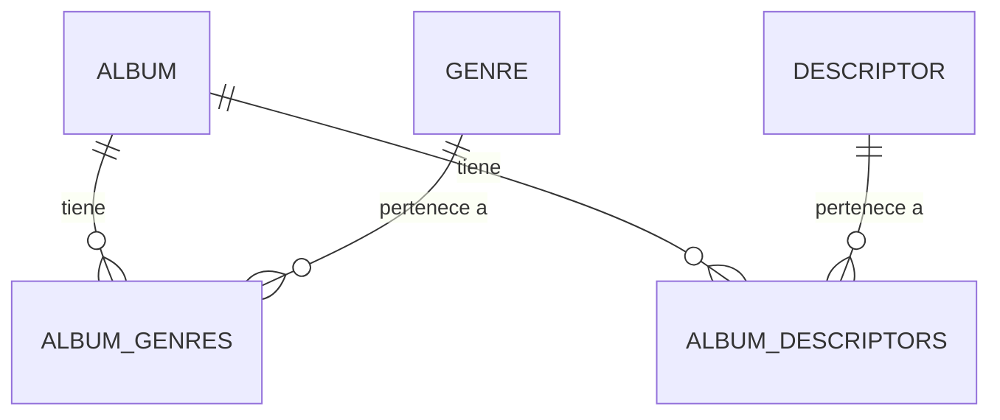

# Explicación de la Base de Datos del Proyecto

## Estructura General

Nuestra base de datos SQLite tiene **5 tablas** en total. Tres son "entidades" reales (Album, Genre, Descriptor) y dos son "tablas puente" que conectan esas entidades entre sí.



---

## Las 3 Tablas Principales

### 1. `album` — La tabla central

Cada fila es un álbum. Acá viven tanto los datos que vienen del CSV de RYM como los que traemos de las APIs.

| Columna | Tipo | ¿De dónde viene? | Ejemplo |
|---|---|---|---|
| `id` | Integer (PK) | Auto-generado | `1` |
| `position` | Integer | CSV (RYM) | `1` |
| `title` | String | CSV (RYM) | `"OK Computer"` |
| `artist` | String | CSV (RYM) | `"Radiohead"` |
| `release_date` | Date | CSV (RYM) | `1997-06-16` |
| `avg_rating` | Float | CSV (RYM) | `4.23` |
| `rating_count` | Integer | CSV (RYM) | `98234` |
| `review_count` | Integer | CSV (RYM) | `2145` |
| `mbid` | String(36) | API (MusicBrainz) | `"a1b2c3d4-..."`|
| `label` | String | API (MusicBrainz) | `"Parlophone"` |
| `lastfm_listeners` | Integer | API (Last.fm) | `5230981` |
| `lastfm_playcount` | Integer | API (Last.fm) | `312847562` |

**PK** = Primary Key. Es el identificador único de cada fila. SQLite lo auto-incrementa.

**`nullable=False`** en el código significa que ese campo es **obligatorio**. Si intentás insertar un álbum sin `title`, la base de datos te va a rechazar la operación.

### 2. `genre` — Catálogo de géneros

Una tabla muy simple que guarda cada género una sola vez.

| id | name |
|---|---|
| 1 | `"Art Rock"` |
| 2 | `"Post-Punk"` |
| 3 | `"Shoegaze"` |

`unique=True` en la columna `name` garantiza que no se pueda repetir un género. Si ya existe "Art Rock", no se crea otro.

### 3. `descriptor` — Catálogo de descriptores

Exactamente igual que `genre`, pero para los descriptores de RYM (ej: "melancholic", "atmospheric").

| id | name |
|---|---|
| 1 | `"melancholic"` |
| 2 | `"atmospheric"` |
| 3 | `"noisy"` |

---

## ¿Qué es Many-to-Many (Muchos a Muchos)?

### El problema

Un álbum puede tener **muchos géneros** (ej: OK Computer es "Art Rock" y "Alternative Rock").
Un género puede pertenecer a **muchos álbumes** (ej: "Art Rock" aparece en OK Computer, In Rainbows, The Wall, etc.).

Esto es una relación **Muchos a Muchos** (Many-to-Many o M2M).

### ¿Por qué no se puede hacer directamente?

Podrías pensar: "¿Por qué no pongo una columna `genres` en la tabla `album` y guardo algo como `'Art Rock, Alternative Rock'`?"

El problema es que eso es un **string plano**. Si después querés hacer una consulta tipo *"¿Cuántos álbumes son de Art Rock?"*, tendrías que buscar dentro de strings con `LIKE '%Art Rock%'`, lo cual es:
- **Lento** (no usa índices).
- **Frágil** (¿qué pasa si alguien escribe "art rock" vs "Art Rock"?).
- **Imposible de relacionar** (no podés hacer JOINs eficientes).

### La solución: Tablas Puente (Association Tables)

Se crea una **tercera tabla** que solo tiene dos columnas: el ID del álbum y el ID del género. Cada fila en esta tabla dice "este álbum tiene este género".

### 4. `album_genres` — Tabla puente entre Album y Genre

| album_id | genre_id | is_primary |
|---|---|---|
| 1 | 1 | `True` |
| 1 | 5 | `False` |
| 2 | 1 | `True` |
| 2 | 3 | `True` |

Esto se lee así:
- El álbum 1 tiene el género 1 (como primario) y el género 5 (como secundario).
- El álbum 2 tiene el género 1 y el género 3 (ambos primarios).

La columna `is_primary` es un extra que agregamos nosotros para distinguir los géneros principales de los secundarios del CSV de RYM.

### 5. `album_descriptors` — Tabla puente entre Album y Descriptor

| album_id | descriptor_id |
|---|---|
| 1 | 1 |
| 1 | 2 |
| 1 | 3 |

Misma idea: el álbum 1 tiene los descriptores "melancholic", "atmospheric" y "noisy".

---

## ¿Cómo se traduce esto al código de Python?

En `models.py`, la magia ocurre en estas líneas:

```python
# Definición de la tabla puente (no es una clase, es solo una tabla)
album_genres = db.Table('album_genres',
    db.Column('album_id', db.Integer, db.ForeignKey('album.id'), primary_key=True),
    db.Column('genre_id', db.Integer, db.ForeignKey('genre.id'), primary_key=True),
    db.Column('is_primary', db.Boolean, default=True)
)

# Dentro de la clase Album:
genres = db.relationship('Genre', secondary=album_genres,
                         backref=db.backref('albums', lazy='dynamic'))
```

### ¿Qué significa cada parte?

- **`db.ForeignKey('album.id')`**: Le dice a la base de datos "esta columna apunta a la tabla `album`, columna `id`". Es una referencia cruzada.

- **`primary_key=True`** en ambas columnas: Significa que la combinación `(album_id, genre_id)` es única. No podés decir dos veces que el álbum 1 tiene el género 1.

- **`db.relationship('Genre', secondary=album_genres)`**: Esto es SQLAlchemy facilitándote la vida. Gracias a esto, en Python podés hacer:
  ```python
  album = Album.query.first()
  print(album.genres)  # [<Genre 'Art Rock'>, <Genre 'Alternative Rock'>]
  ```
  Sin necesidad de escribir SQL con JOINs manualmente.

- **`backref=db.backref('albums', lazy='dynamic')`**: Esto crea la relación **inversa**. Desde un género, podés ver qué álbumes lo tienen:
  ```python
  genre = Genre.query.filter_by(name='Art Rock').first()
  print(genre.albums.all())  # [<Album 'OK Computer'>, <Album 'In Rainbows'>, ...]
  ```

---

## Ejemplo Visual Completo

Imaginá que tenemos estos datos:

```
Album: "OK Computer" de Radiohead (id=1)
  → Géneros primarios: Art Rock, Alternative Rock
  → Géneros secundarios: Electronic
  → Descriptores: melancholic, anxious, atmospheric

Album: "Kid A" de Radiohead (id=2)
  → Géneros primarios: Art Rock, Electronic
  → Descriptores: cold, atmospheric, experimental
```

Así quedarían las tablas:

**album**
| id | title | artist |
|---|---|---|
| 1 | OK Computer | Radiohead |
| 2 | Kid A | Radiohead |

**genre**
| id | name |
|---|---|
| 1 | Art Rock |
| 2 | Alternative Rock |
| 3 | Electronic |

**album_genres**
| album_id | genre_id | is_primary |
|---|---|---|
| 1 | 1 | True |
| 1 | 2 | True |
| 1 | 3 | False |
| 2 | 1 | True |
| 2 | 3 | True |

**descriptor**
| id | name |
|---|---|
| 1 | melancholic |
| 2 | anxious |
| 3 | atmospheric |
| 4 | cold |
| 5 | experimental |

**album_descriptors**
| album_id | descriptor_id |
|---|---|
| 1 | 1 |
| 1 | 2 |
| 1 | 3 |
| 2 | 3 |
| 2 | 4 |
| 2 | 5 |

Fijate cómo "atmospheric" (id=3) aparece en ambos álbumes. Y "Art Rock" (id=1) también. La tabla puente permite esas conexiones múltiples sin duplicar datos.

---

## ¿Por qué es útil para el TP?

Con esta estructura podés hacer consultas analíticas poderosas con SQL o SQLAlchemy:

- *"¿Cuál es el género con mejor rating promedio?"*
- *"¿Cuántos álbumes de Electronic tienen más de 1 millón de listeners en Last.fm?"*
- *"¿Qué descriptores son más comunes en los álbumes mejor puntuados?"*

Todo esto sería prácticamente imposible (o muy ineficiente) si los géneros estuvieran guardados como un string separado por comas dentro de la tabla `album`.
